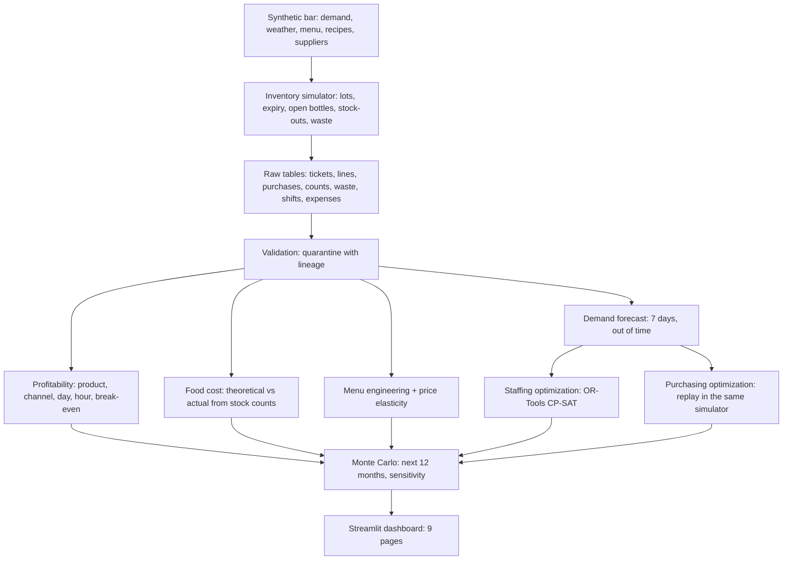

# Prime Cost: where does a small restaurant make its money, and where does it leak?

[](https://github.com/AlvaroVerona/prime-cost/actions/workflows/ci.yml)


**Prime cost** is what a restaurateur watches first: the cost of product plus the cost of labor. This project follows
that number through a synthetic Madrid wine bar and tapas restaurant, **La Cepa**, and answers the questions a consultant
would ask an owner:

- Which dishes, channels and hours actually make money once everything is paid?
- How much product leaves the building without being sold, and why?
- Which dishes should be promoted, repriced or dropped?
- How many guests will come next week, and what should we buy and who should we schedule?
- What does the next year look like, with the uncertainty included?

Everything runs end to end on 24 months of simulated operations (about 30,000 tickets and 212,000 order lines): data quality,
profitability, stock reconciliation, menu engineering, a demand forecast, two optimizations and a Monte Carlo of next year, behind a
9-page Streamlit dashboard. Every number in this README comes from one run of the pipeline (`make all`, seed 42, 4 minutes 42 seconds).

> The data are synthetic and the simulator is mine, so the results show that the methods work and what they would be worth on a bar
> like this one, not what a real bar would earn. The limitations section says exactly where that matters.

## What it found

| | |
|---|---|
| Business | 56 seats, **€1.05M revenue** in the last 12 months, **13.6% EBITDA**, prime cost **59.5%** |
| Data quality | **99.6 / 100**; 722 of 271,569 records quarantined. All injected duplicates, empty channels, negative quantities and wrong prices were caught (119/119, 89/89, 169/169, 424/424); 10 of 14 timestamp errors, the rest are undetectable by an opening-hours rule |
| Stock cost | Recipes and sales say product cost should have been **€537k**; stock counts say it was **€625k**, a **16.4% gap (€88k)** over two years. The team logged only 49% of it |
| Hidden losses recovered | The simulator really lost €81k to expiry, prep errors and over-portioning (plus unlabelled over-pouring of wine). The reconciliation measured €88k, so the method finds the leak |
| Delivery | A delivery order leaves **€13.83** of contribution; a dining-room ticket leaves **€56.32**. One table is worth four delivery orders |
| Weak hours | Tuesday and Wednesday at 5 pm do not cover the people on shift (about -€30 per hour) |
| Demand forecast | Gradient boosting: **14.1% error vs 20.3%** for the naive weekday average (**30% less**), on 72 days never used for fitting. Linear regression with the same inputs does not beat the baseline (20.6%) |
| Staffing | A schedule built from the forecast cuts labor of the three optimized roles **15%** (about **€37k a year**) and cuts hours with too few people from 79 to 36 |
| Purchasing | Ordering against the forecast saves **€7.6k ± €0.5k in 12 weeks** (about **€28k a year**) in waste and sales lost to stock-outs, better in all 10 random seeds |
| Next 12 months | Expected EBITDA **€143k** (5th percentile €115k) as is, **€189k** (€160k) applying the recommendations with only 60% of the benefit assumed |

## Architecture



## How it works

### 1. A simulator with a hidden truth (`src/prime_cost/data/`, `simulation/inventory_engine.py`)

La Cepa has 35 dishes and drinks, 30 wines (10 sold by the glass), 47 ingredients with recipes and trim losses, 8 suppliers with their own
delivery calendars, a weekly stock count on the closed day (Monday) and a fixed weekly staff template. Guests arrive according to weekday, season,
holidays, a monthly tasting night, temperature and rain; they order by popularity, daypart and price. Two price rounds and an olive-oil price
shock are built in.

The point of a simulator is that **it knows the truth the analysis has to find**: it over-portions ham and shrimp, over-pours wine, throws away
expired fresh product that is only partly logged, and lets some sales be lost to stock-outs. Because those losses are recorded separately, the
tests check that the analysis recovers them.

### 2. Data quality (`quality/validation.py`)

Schema, duplicates, validity, referential integrity and price checks. CRITICAL and HIGH records are quarantined, each on its own with the rule and
reason; MEDIUM findings stay in (a supplier invoicing 3% above the agreed price is a business finding, not a corrupt row). RAW minus QUARANTINED
equals VALIDATED, and the tests verify it.

### 3. Profitability (`analytics/profitability.py`)

Contribution = revenue - recipe cost - delivery commission and packaging - card fees, for every order line. Aggregated by dish, category, channel,
daypart, weekday and hour, plus the hours that do not pay for the staff on shift, unit economics per ticket and break-even revenue
(**€65k a month**, a 26% safety margin).

### 4. Food cost (`analytics/food_cost.py`)

Weekly, between Monday counts: `actual use = opening + purchases - closing`, against `theoretical use = recipes x sales`. The gap splits into
logged waste and an unexplained remainder (unlogged waste, over-portioning, over-pouring, counting noise), by ingredient. The largest gaps are ham,
shrimp, tartare meat and squid, and ham is where over-portioning is clearest (about €9.8k unexplained). Most logged waste is expiry: product
bought for days it could not be sold.

### 5. Menu engineering (`analytics/menu_engineering.py`)

Kasavana and Smith matrix inside each family (tapas, drinks, wine by the glass, wine by the bottle, desserts and coffee): popularity against
margin per unit gives Stars, Plowhorses, Puzzles and Dogs, each with an action. Ham croquettes, the second best-selling tapa, are a Plowhorse with a
39% product cost, the worst ratio among the top sellers. The two real price rounds are used to estimate **price elasticity** by difference-in-differences with a bootstrap interval.

| Category | Elasticity | 90% interval | Used (shrunk to a prior) |
|---|---|---|---|
| Tapas | -1.33 | -2.68 to -0.04 | -0.95 |
| Drinks | -0.37 | -1.27 to 0.72 | -0.62 |
| Wine by the glass | -0.51 | -1.58 to 0.53 | -0.69 |
| Wine by the bottle | +0.66 | -0.67 to 2.26 | -0.45 |

A 4-5% price move seen for a few weeks identifies elasticity only roughly (one estimate even has the wrong sign). So the estimates are shrunk toward
a conservative prior, and every price recommendation is also tested under a pessimistic elasticity of -1.2: only dishes that still gain count
(about €19k a year for +5% on those dishes).

### 6. Demand forecast (`forecasting/demand.py`)

Guests per day for the next 7 days. Each (forecast date, target day) pair uses only what was known at the forecast date: calendar, weather, recent
level, the same weekday's recent average and the horizon. Evaluation is rolling-origin on the last 12 weeks, refitting every week, and the
weather inputs get noise so they behave like a real weather forecast. The 80% interval is calibrated on the first half of the test weeks and its
coverage measured on the second half: **84.5%**, never on the data it was fitted on.

| Model | Error (WAPE) |
|---|---|
| Weekday average of the last 4 weeks (naive) | 20.3% |
| Recent level x weekday profile | 20.5% |
| Ridge regression | 20.6% |
| **Gradient boosting** | **14.1%** |

### 7. Staffing (`optimization/staffing.py`)

Forecast guests become the people needed per hour and role (one person serves 14 guests on the floor, 28 in the kitchen, 24 at the bar). A
CP-SAT model chooses shifts of 4 to 9 hours at the least cost, covering every hour, with limits on shifts and hours per person. It is judged on the
guests that really came against the fixed template used today: **€56.6k to €48.1k over 72 days**, with overstaffed head-hours falling from 852
to 223 and hours with a gap from 79 to 36.

### 8. Purchasing (`optimization/purchasing.py`)

The last 12 weeks are replayed **in the same inventory simulator that produced the data**, with the same guests, under two ordering policies.
Today's rule is the average use of the last 28 days times cover days plus safety days. The alternative orders the forecast use of the days the
delivery must cover, capped at the shelf life, plus a safety stock from the newsvendor critical ratio (a dry good that cannot spoil gets a big buffer,
fresh fish a small one). Both are run with 10 random seeds, because the simulator has chance events:

| 12 weeks | Today's rule | Forecast-based |
|---|---|---|
| Waste (thrown away) | €9,726 | €5,996 |
| Margin lost to stock-outs | €25,240 | €21,353 |
| Saving | | **€7,618 ± €492** (better in 10 of 10 seeds) |

### 9. Scenarios (`simulation/scenarios.py`)

5,000 simulated years from the bar's own history: demand growth (half of the observed 10% is extrapolated) and monthly noise, ingredient price
drift and volatility, a wage rise every January and a rent indexation. Both strategies (as is, and with the recommendations at 60% realisation)
run on **the same random draws**, so the gap between them is the effect of the actions, not luck. A 10% move in guests moves EBITDA by €69k,
ingredient prices by €33k, wages by €30k and fixed costs by €25k; a 10% menu price rise adds €44k if demand reacts with elasticity -0.8.

## Dashboard

Nine pages that read the pipeline outputs in `reports/outputs/` (they are committed, so the dashboard works right after cloning):
Overview, Data Quality, Profitability, Food Cost and Waste, Menu Engineering, Demand Forecast, Staffing, Purchasing and Scenarios.

## Run it

```bash
git clone https://github.com/AlvaroVerona/prime-cost.git
cd prime-cost
python -m venv .venv && source .venv/bin/activate
pip install -e ".[dev]"

make dashboard    # uses the committed outputs; no pipeline run needed
make all          # regenerates everything, about 5 minutes: data, validation, analytics, optimizers, scenarios, tests
```

Individual stages: `make generate-data`, `validate`, `profitability`, `food-cost`, `menu`, `forecast`, `staffing`, `purchasing`, `scenarios`,
`headline`, `test`, `lint`.

## Repository

```text
config/settings.yaml, menu.yaml        every parameter and the whole catalog; nothing hardcoded in src/
src/prime_cost/
  data/                                calendar and weather, demand, catalog and prices, staff, generator
  simulation/                          inventory engine (lots, expiry, open bottles, stock-outs); Monte Carlo scenarios
  quality/                             validation and quarantine
  analytics/                           profitability, food cost, menu engineering and elasticity
  forecasting/                         demand forecast
  optimization/                        staffing (CP-SAT) and purchasing (policy replay)
  reporting/                           headline numbers for the dashboard and this README
app/                                   Streamlit dashboard (a router and 9 views)
tests/                                 55 tests
docs/ENGINEERING_LOG.md                the decisions, and the bugs found while building it
reports/outputs/                       pipeline results (small CSV/JSON), committed
```

## Limitations

- **The data are synthetic and I wrote the simulator.** The methods are validated against a truth I planted, which proves they work, not that a real bar
  looks like this one. Real bars have messier recipes, fewer data and no clean labels.
- **The ordering baseline is a simple rule of thumb.** A careful manager who orders by weekday would already capture part of the purchasing gain.
- **Lost sales from stock-outs are an upper bound.** They assume a guest who finds a dish sold out orders nothing else.
- **The staffing need model is an assumption** (guests per person per role). The data do not link staffing to sales or service quality, so the benefit is cost
  and coverage, not revenue.
- **Price elasticity is weakly identified** from two small price rounds; recommendations are therefore tested against a range, and cross-effects between
  dishes are ignored.
- **Weather inputs to the forecast are noisy copies of the true weather**, which only approximates a real forecast service.
- **Menu prices are treated as net of VAT**, and the owner's pay is counted as a cost so the margin is comparable to a bar run by a hired manager.
- **One bar, one city.** No competitors, reviews, reservations or no-shows.

## Future improvements

Real point-of-sale and invoice integration, item-level demand models for the highest-value ingredients, supplier-specific lead-time uncertainty in the
purchasing policy, a cross-price demand model for the menu, reservations and no-show modelling, and a pilot comparing the recommendations on a real bar.

## Licence

MIT, see [LICENSE](LICENSE).
